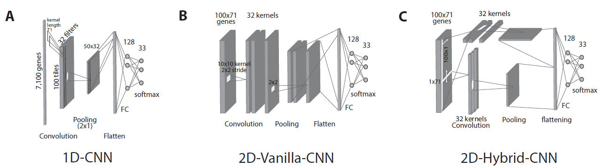

# Predicting all 33-cancer types and their normal tissues with CNN

Folder ending with 33 class contains models which only work for classification of 33 cancer tumors. In order to see the impact of Normal tissues in classification, the codes that are in 34 class folder need to be run. Hyperparameter tuning folder is showing grid search result of some of the hyperparameters for 1D-CNN and Vanilla models. All codes are written in Keras with a simple structure which helps reader understand the modeling stage easier. 

## Background
Precise prediction of cancer types is vital for cancer diagnosis and therapy. Important cancer marker genes can be inferred through predictive model. Several studies have attempted to build machine learning models for this task however none has taken into consideration the tissue of origin effects that can potentially bias the identification of cancer markers.
## Results
In this paper, we introduced several Convolutional Neural Network (CNN) models that take unstructured gene expression inputs to classify tumor and non-tumor samples into their designated cancer types or as normal. Based on different designs of gene embeddings and convolution schemes, we implemented three CNN models: 1D-CNN, 2D-Vanilla-CNN, and 2D-Hybrid-CNN. The models were trained and tested on combined 10,340 samples of 33 cancer types and 731 matched normal tissues of The Cancer Genome Atlas (TCGA). Our models achieved excellent prediction accuracies (93.9-95.0%) among 34 classes (33 cancers and normal). Furthermore, we interpreted the 1D-CNN model with a guided saliency technique and identified a total of 2,090 cancer markers (108 per class). The concordance of differential expression of these markers between the cancer type they represent and others is confirmed. In breast cancer, for instance, our model identified well-known markers, such as GATA3 and ESR1. Finally, we extended the 1D-CNN model for prediction of breast cancer subtypes and achieved an average accuracy of 88.42% among 5 subtypes.
## Conclusions
Here we present novel CNN designs for accurate and simultaneous cancer/normal and cancer types prediction based on gene expression profiles, and unique model interpretation scheme to elucidate biologically relevance of cancer marker genes after eliminating the effects of tissue-of-origin. The proposed model had light hyperparameters to be trained and thus can be easily adapt to facilitate cancer diagnosis in the future.
